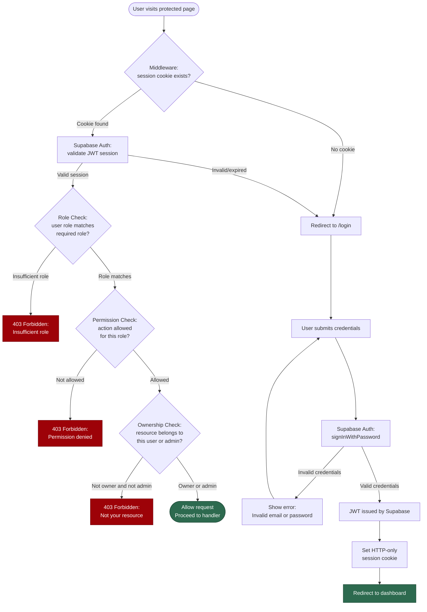
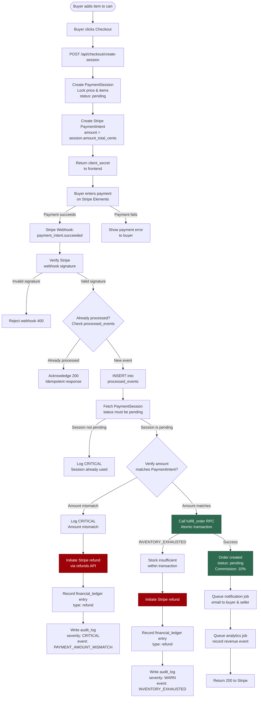
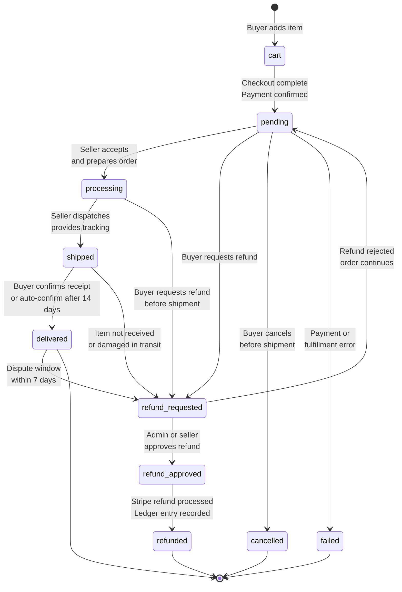
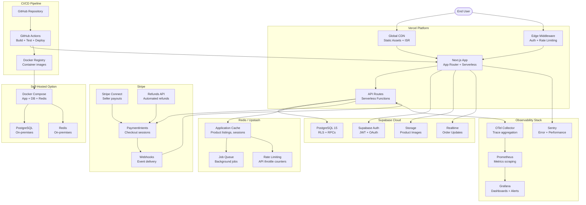
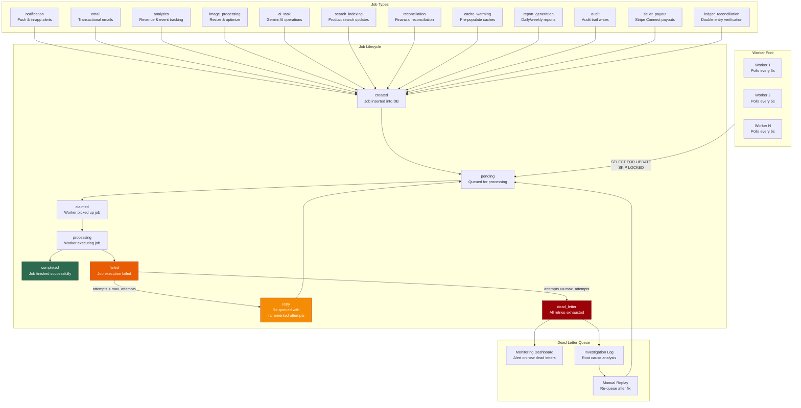

# VendorTrack System Diagrams

This document provides a comprehensive set of Mermaid diagrams for the VendorTrack multi-vendor marketplace platform. VendorTrack is built on Next.js with Supabase, Stripe, Redis, and Gemini AI. Each diagram below includes a prose description followed by the Mermaid code block.

---

## 1. System Architecture

The VendorTrack system follows a strict four-layer architecture that separates concerns across Presentation, Service, Repository, Infrastructure, and Shared modules. The Presentation layer contains all Next.js App Router constructs including pages, layouts, API route handlers, and server actions. The Service layer encapsulates business logic for checkout, admin operations, user management, search, inventory, analytics, AI-powered chat, and notifications. The Repository layer provides data access abstractions for products, orders, carts, users, payment sessions, audit logs, and chat conversations. The Infrastructure layer integrates external services: Supabase for database and auth, Stripe for payments, Redis for caching, Gemini AI for intelligent features, Sentry for error tracking, and OpenTelemetry for observability. The Shared layer provides cross-cutting concerns: authentication utilities, cache helpers, error types, logging, monitoring, security middleware, performance instrumentation, and environment configuration.

```mermaid
graph TB
    subgraph Presentation["Presentation Layer"]
        Pages["Pages<br/>/dashboard, /products, /orders, /checkout"]
        Layouts["Layouts<br/>RootLayout, DashboardLayout, SellerLayout"]
        APIRoutes["API Routes<br/>/api/webhooks/stripe<br/>/api/health<br/>/api/jobs"]
        ServerActions["Server Actions<br/>addToCart, createCheckout<br/>updateProduct, sendMessage"]
    end

    subgraph Service["Service Layer"]
        CheckoutSvc["CheckoutService"]
        AdminSvc["AdminService"]
        UserSvc["UserService"]
        SearchSvc["SearchService"]
        InventorySvc["InventoryService"]
        AnalyticsSvc["AnalyticsService"]
        ChatSvc["ChatService"]
        NotificationSvc["NotificationService"]
    end

    subgraph Repository["Repository Layer"]
        ProductRepo["ProductRepository"]
        OrderRepo["OrderRepository"]
        CartRepo["CartRepository"]
        UserRepo["UserRepository"]
        PaymentSessionRepo["PaymentSessionRepository"]
        AuditLogRepo["AuditLogRepository"]
        ChatRepo["ChatRepository"]
    end

    subgraph Infrastructure["Infrastructure Layer"]
        Supabase["Supabase<br/>PostgreSQL + Auth + RLS"]
        Stripe["Stripe<br/>PaymentIntents + Webhooks"]
        Redis["Redis / Upstash<br/>Cache + Job Queue"]
        GeminiAI["Gemini AI<br/>Chat + Search"]
        Sentry["Sentry<br/>Error Tracking"]
        OTel["OpenTelemetry<br/>Traces + Metrics"]
    end

    subgraph Shared["Shared Layer"]
        AuthUtil["auth"]
        CacheUtil["cache"]
        Errors["errors"]
        Logger["logger"]
        Monitoring["monitoring"]
        Security["security"]
        Performance["performance"]
        EnvConfig["env"]
    end

    Pages --> ServerActions
    Pages --> APIRoutes
    Layouts --> ServerActions

    ServerActions --> CheckoutSvc
    ServerActions --> UserSvc
    ServerActions --> InventorySvc
    ServerActions --> ChatSvc
    APIRoutes --> CheckoutSvc
    APIRoutes --> NotificationSvc
    APIRoutes --> AnalyticsSvc

    CheckoutSvc --> PaymentSessionRepo
    CheckoutSvc --> OrderRepo
    CheckoutSvc --> CartRepo
    AdminSvc --> UserRepo
    AdminSvc --> AuditLogRepo
    UserSvc --> UserRepo
    SearchSvc --> ProductRepo
    InventorySvc --> ProductRepo
    AnalyticsSvc --> OrderRepo
    AnalyticsSvc --> AuditLogRepo
    ChatSvc --> ChatRepo
    NotificationSvc --> UserRepo

    ProductRepo --> Supabase
    OrderRepo --> Supabase
    CartRepo --> Supabase
    UserRepo --> Supabase
    PaymentSessionRepo --> Supabase
    AuditLogRepo --> Supabase
    ChatRepo --> Supabase

    CheckoutSvc --> Stripe
    SearchSvc --> GeminiAI
    ChatSvc --> GeminiAI
    SearchSvc --> Redis
    UserSvc --> Redis
    InventorySvc --> Redis

    CheckoutSvc --> AuthUtil
    CheckoutSvc --> CacheUtil
    CheckoutSvc --> Logger
    AdminSvc --> AuthUtil
    AdminSvc --> Security
    UserSvc --> AuthUtil
    NotificationSvc --> Performance
    AnalyticsSvc --> Monitoring
    ChatSvc --> Errors

    ProductRepo --> Logger
    OrderRepo --> Logger
    PaymentSessionRepo --> Errors
    AuditLogRepo --> Monitoring

    Supabase --> OTel
    Stripe --> OTel
    Redis --> OTel

    ServerActions --> Sentry
    APIRoutes --> Sentry
    Service --> Sentry
```

---

## 2. Authentication Flow

VendorTrack uses Supabase Auth for identity management with JWT-based sessions. The authentication flow has two primary paths: the login/registration flow and the authorization flow for protected resources. When a user visits a protected page, the Next.js middleware intercepts the request and validates the session against Supabase. If no valid session exists, the user is redirected to the login page. Upon successful credential submission, Supabase Auth issues a JWT which is stored as an HTTP-only cookie. For subsequent requests, the middleware validates the session, then performs a role check to ensure the user has the correct role (buyer, seller, or admin), followed by a permission check for the specific action, and finally an ownership check to ensure the user can only access their own resources unless they are an admin. The `security` shared module enforces that users cannot escalate their own roles or admin status, as enforced by the RLS policies on the `profiles` table.

---

## 3. Payment Flow

The payment flow is the most critical path in VendorTrack, designed for financial integrity and idempotency. When a buyer initiates checkout, the system creates a server-side PaymentSession that locks the price and inventory. A Stripe PaymentIntent is then created with the exact amount from the session. The buyer completes payment on the Stripe-hosted form. Upon successful payment, Stripe sends a `payment_intent.succeeded` webhook to the `/api/webhooks/stripe` endpoint. The webhook handler verifies the event signature, checks for duplicate processing via the `processed_events` table, then validates the session and amount. The `fulfill_order` RPC function executes atomically within PostgreSQL: it locks the session row, decrements product stock with a check for sufficient inventory, creates the order record, calculates the 10% platform commission, marks the session as completed, and writes an audit log entry. After fulfillment, notification and analytics jobs are queued. If any step in the webhook processing fails, the system initiates an automatic refund via Stripe, records a ledger entry, and logs the event to the audit trail.

---

## 4. Order Lifecycle

Orders in VendorTrack follow a well-defined state machine with specific allowed transitions. Every order begins in the `cart` state when a buyer adds items. Once checkout completes and payment is confirmed, the order transitions to `pending`. From `pending`, the seller can mark the order as `processing` (preparing the item), then `shipped` (item dispatched), and finally `delivered` (buyer confirmed receipt). There are three branching paths from `pending`: a buyer may request a refund, transitioning the order to `refund_requested`; if the admin or seller approves, the order moves to `refund_approved` and then to `refunded`, which triggers a Stripe refund and a financial ledger entry. An order can also be `cancelled` by the buyer before shipment. Finally, if the payment or fulfillment fails, the order transitions to `failed`. Each transition is logged in the audit trail with a trace ID for financial reconciliation.

---

## 5. Database ER Diagram

The VendorTrack database schema comprises 17 tables designed for financial integrity, auditability, and multi-tenant data isolation. The `profiles` table extends Supabase Auth users with role and seller information. `products` and `orders` form the core marketplace tables, with orders tracking both buyer and seller references. `payment_sessions` provide server-side price locking during checkout. The `financial_ledger` table records all monetary movements with debit/credit entries for reconciliation. `audit_logs` and `processed_events` ensure idempotency and compliance. The `conversations` and `messages` tables power the AI chat feature. `background_jobs` and `payment_job_queue` manage asynchronous processing. `reconciliation_reports` provide daily financial summaries. Operational tables like `feature_flags`, `backups`, `deployments`, and `incidents` support the DevOps workflow. All tables use UUIDs as primary keys and `TIMESTAMPTZ` for timestamps.

```mermaid
erDiagram
    profiles {
        UUID id PK "References auth.users"
        TEXT email UK
        TEXT full_name
        TEXT role "buyer | seller"
        BOOLEAN is_admin
        TEXT seller_status "pending | approved | rejected"
        TEXT store_name
        TEXT store_description
        TEXT store_logo_url
        TEXT stripe_account_id
        BOOLEAN stripe_connected
        TEXT referral_code UK
        TIMESTAMPTZ created_at
    }

    products {
        UUID id PK
        UUID seller_id FK
        TEXT title
        TEXT category
        TEXT description
        INTEGER price_cents "CHECK > 0"
        INTEGER stock "CHECK >= 0"
        TEXT image_url
        TEXT status "active | draft"
        TIMESTAMPTZ created_at
        TIMESTAMPTZ deleted_at
    }

    cart_items {
        UUID id PK
        UUID user_id FK
        UUID product_id FK
        INTEGER quantity
        TIMESTAMPTZ created_at
    }

    payment_sessions {
        UUID id PK
        UUID user_id FK
        JSONB items
        INTEGER amount_total_cents
        TEXT status "pending | completed | failed"
        TIMESTAMPTZ expires_at
        TIMESTAMPTZ created_at
    }

    orders {
        UUID id PK
        UUID buyer_id FK
        UUID seller_id FK
        UUID product_id FK
        TEXT product_name
        INTEGER quantity
        INTEGER amount_total_cents
        INTEGER commission_cents
        TEXT status "pending | shipped | delivered | refunded"
        TEXT refund_status "none | requested | approved | rejected"
        TEXT refund_reason
        TEXT payment_intent_id UK
        TEXT trace_id UK
        TIMESTAMPTZ created_at
    }

    financial_ledger {
        UUID id PK
        UUID order_id FK
        TEXT entry_type "debit | credit | refund | commission | payout"
        INTEGER amount_cents
        TEXT currency "Default: usd"
        TEXT description
        TEXT reference_id
        TIMESTAMPTZ created_at
    }

    audit_logs {
        UUID id PK
        TEXT trace_id
        TEXT event_type
        TEXT severity "INFO | WARN | CRITICAL"
        JSONB payload
        TIMESTAMPTZ created_at
    }

    processed_events {
        TEXT id PK "Stripe event ID"
        TIMESTAMPTZ created_at
    }

    conversations {
        UUID id PK
        UUID buyer_id FK
        UUID seller_id FK
        UUID product_id FK
        TEXT status "open | closed"
        TIMESTAMPTZ created_at
        TIMESTAMPTZ updated_at
    }

    messages {
        UUID id PK
        UUID conversation_id FK
        UUID sender_id FK
        TEXT content
        BOOLEAN is_ai_generated
        TEXT metadata
        TIMESTAMPTZ created_at
    }

    background_jobs {
        UUID id PK
        TEXT job_type
        JSONB payload
        TEXT status "created | pending | claimed | processing | completed | failed | dead_letter"
        INTEGER attempts
        INTEGER max_attempts
        TEXT error_message
        TIMESTAMPTZ scheduled_at
        TIMESTAMPTZ claimed_at
        TIMESTAMPTZ completed_at
        TIMESTAMPTZ created_at
    }

    payment_job_queue {
        UUID id PK
        UUID order_id FK
        TEXT job_type "payout | refund | reconciliation"
        TEXT status "pending | processing | completed | failed"
        JSONB payload
        TEXT error_message
        TIMESTAMPTZ created_at
        TIMESTAMPTZ processed_at
    }

    reconciliation_reports {
        UUID id PK
        DATE report_date
        INTEGER total_revenue_cents
        INTEGER total_commission_cents
        INTEGER total_refunds_cents
        INTEGER total_payouts_cents
        TEXT status "draft | verified | disputed"
        TIMESTAMPTZ created_at
    }

    feature_flags {
        UUID id PK
        TEXT name UK
        BOOLEAN enabled
        TEXT description
        JSONB rules
        TIMESTAMPTZ updated_at
    }

    backups {
        UUID id PK
        TEXT storage_path
        TEXT status "pending | completed | failed"
        INTEGER size_bytes
        TIMESTAMPTZ created_at
    }

    deployments {
        UUID id PK
        TEXT version
        TEXT environment "staging | production"
        TEXT status "pending | deploying | live | rolled_back"
        TEXT commit_sha
        TIMESTAMPTZ deployed_at
    }

    incidents {
        UUID id PK
        TEXT title
        TEXT severity "low | medium | high | critical"
        TEXT status "open | investigating | resolved"
        TEXT description
        TIMESTAMPTZ started_at
        TIMESTAMPTZ resolved_at
    }

    profiles ||--o{ products : "sells"
    profiles ||--o{ orders : "buys as buyer"
    profiles ||--o{ orders : "sells as seller"
    profiles ||--o{ cart_items : "owns"
    profiles ||--o{ payment_sessions : "creates"
    profiles ||--o{ conversations : "participates as buyer"
    profiles ||--o{ conversations : "participates as seller"
    products ||--o{ cart_items : "added to"
    products ||--o{ orders : "ordered in"
    products ||--o{ conversations : "discussed in"
    orders ||--o{ financial_ledger : "has entries"
    orders ||--o{ payment_job_queue : "has jobs"
    conversations ||--o{ messages : "contains"
    profiles ||--o{ messages : "sends"
```

---

## 6. Deployment Architecture

VendorTrack is deployed on a cloud-native stack with Vercel as the primary hosting platform. The Next.js application runs on Vercel with Edge Functions for low-latency middleware and a global CDN for static assets. Supabase provides the managed PostgreSQL database with built-in authentication and Row Level Security. Redis via Upstash serves as the caching and job queue layer, accessible from both Vercel Edge and serverless functions. Stripe handles all payment processing with webhook delivery to the Vercel API routes. Sentry captures runtime errors and performance issues across the entire stack. Prometheus and Grafana provide metrics collection and visualization, with OpenTelemetry for distributed tracing. GitHub Actions manages the CI/CD pipeline, building and deploying on every push. A Docker-based self-hosted option is available for vendors who require on-premises deployment, using the same container images built in the CI pipeline.

---

## 7. CI/CD Pipeline

The VendorTrack CI/CD pipeline is implemented with GitHub Actions and runs on every push to the main and develop branches, as well as on pull requests. The pipeline has ten stages that execute in sequence, with early termination on failure. The first stage runs ESLint for code quality checks. The second stage runs the TypeScript compiler in strict mode to catch type errors. The third stage executes the unit test suite with Jest. The fourth stage runs a security scan using `npm audit` and SAST tools to detect known vulnerabilities. The fifth stage builds the Next.js application. The sixth stage builds the Docker image for the self-hosted deployment option. The seventh stage deploys to the staging environment on Vercel. The eighth stage deploys to production after staging verification. The ninth stage runs smoke tests and health checks against the production deployment. The tenth stage provides a manual rollback mechanism if any issue is detected post-deployment.

```mermaid
flowchart LR
    subgraph Trigger["Pipeline Trigger"]
        Push["Push to main/develop<br/>or Pull Request"]
    end

    subgraph Stage1["Stage 1: Lint"]
        Lint["ESLint<br/>Code quality rules<br/>Custom config"]
    end

    subgraph Stage2["Stage 2: TypeCheck"]
        TypeCheck["TypeScript Compiler<br/>Strict mode enabled<br/>No implicit any"]
    end

    subgraph Stage3["Stage 3: Unit Tests"]
        UnitTests["Jest Test Suite<br/>Service layer tests<br/>Repository mocks<br/>Coverage threshold: 80%"]
    end

    subgraph Stage4["Stage 4: Security Scan"]
        SecScan["npm audit<br/>SAST analysis<br/>Dependency vulnerability check<br/>Secret detection"]
    end

    subgraph Stage5["Stage 5: Build"]
        Build["Next.js Production Build<br/>Static generation<br/>Bundle analysis"]
    end

    subgraph Stage6["Stage 6: Docker Build"]
        DockerBuild["Docker Image Build<br/>Multi-stage Dockerfile<br/>Push to registry<br/>Tag with commit SHA"]
    end

    subgraph Stage7["Stage 7: Deploy Staging"]
        DeployStaging["Vercel Preview Deploy<br/>Environment: staging<br/>Supabase staging DB<br/>Integration tests"]
    end

    subgraph Stage8["Stage 8: Deploy Production"]
        DeployProd["Vercel Production Deploy<br/>Environment: production<br/>Blue-green deployment<br/>Zero downtime"]
    end

    subgraph Stage9["Stage 9: Verify"]
        Verify["Smoke Tests<br/>Health check endpoint<br/>Database connectivity<br/>Stripe webhook test<br/>Sentry error check"]
    end

    subgraph Stage10["Stage 10: Rollback"]
        Rollback["Manual Rollback Trigger<br/>Vercel instant rollback<br/>Database migration revert<br/>Incident creation"]
    end

    Push --> Lint
    Lint -->|Pass| TypeCheck
    Lint -->|Fail| Fail1([Pipeline Failed])
    TypeCheck -->|Pass| UnitTests
    TypeCheck -->|Fail| Fail2([Pipeline Failed])
    UnitTests -->|Pass| SecScan
    UnitTests -->|Fail| Fail3([Pipeline Failed])
    SecScan -->|Pass| Build
    SecScan -->|Fail| Fail4([Pipeline Failed])
    Build -->|Pass| DockerBuild
    Build -->|Fail| Fail5([Pipeline Failed])
    DockerBuild -->|Pass| DeployStaging
    DockerBuild -->|Fail| Fail6([Pipeline Failed])
    DeployStaging -->|Healthy| DeployProd
    DeployStaging -->|Unhealthy| Fail7([Pipeline Failed])
    DeployProd -->|Deployed| Verify
    DeployProd -->|Error| Fail8([Pipeline Failed])
    Verify -->|All checks pass| Success([Deployment Complete])
    Verify -->|Checks failed| Rollback
    Rollback -->|Rolled back| RollbackDone([Rollback Complete])

    style Success fill:#2d6a4f,stroke:#1b4332,color:#fff
    style RollbackDone fill:#e85d04,stroke:#9d0208,color:#fff
    style Fail1 fill:#9d0208,stroke:#6a040f,color:#fff
    style Fail2 fill:#9d0208,stroke:#6a040f,color:#fff
    style Fail3 fill:#9d0208,stroke:#6a040f,color:#fff
    style Fail4 fill:#9d0208,stroke:#6a040f,color:#fff
    style Fail5 fill:#9d0208,stroke:#6a040f,color:#fff
    style Fail6 fill:#9d0208,stroke:#6a040f,color:#fff
    style Fail7 fill:#9d0208,stroke:#6a040f,color:#fff
    style Fail8 fill:#9d0208,stroke:#6a040f,color:#fff
```

---

## 8. Background Jobs

The background job system in VendorTrack handles all asynchronous processing that must not block the request-response cycle. Jobs are stored in the `background_jobs` table with a well-defined lifecycle. A job is created with status `created`, then transitions to `pending` when queued for processing. A worker claims the job, setting status to `claimed` and recording the claim timestamp. The worker then processes the job, transitioning to `processing`. On successful completion, the job status becomes `completed`. On failure, the job is retried up to `max_attempts` times. If all retries are exhausted, the job enters the `dead_letter` state for manual investigation. The system supports twelve job types: notification delivery, email sending, analytics event recording, image processing and optimization, AI-powered task execution via Gemini, search index updates, financial reconciliation, cache warming, report generation, audit trail writes, seller payout processing via Stripe Connect, and ledger reconciliation. Each job type has specific payload schemas and retry policies.

---

## Diagram Summary

| Diagram | Type | Key Insights |
|---|---|---|
| System Architecture | Component graph | Four-layer separation with clear dependency direction |
| Authentication Flow | Flowchart | Multi-step authorization: session, role, permission, ownership |
| Payment Flow | Flowchart | Idempotent webhook handling with atomic fulfillment RPC |
| Order Lifecycle | State diagram | Six terminal states with controlled refund and cancel branches |
| Database ER | Entity-relationship | 17 tables with RLS policies and financial integrity constraints |
| Deployment Architecture | Component graph | Cloud-native Vercel deployment with self-hosted Docker option |
| CI/CD Pipeline | Flowchart | Ten-stage pipeline with security scanning and manual rollback |
| Background Jobs | Flowchart | Twelve job types with retry logic and dead letter queue |
